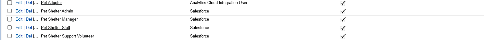

# 🐾 Pet Adoption Tracker – Phase 2 Setup  

The **Pet Adoption Tracker** Salesforce CRM is designed to streamline the process of managing pets, adopters, and adoption requests in an animal shelter or NGO.  
This phase focuses on **org setup, business hours, fiscal cycles, roles, profiles, access control, and deployment basics** to ensure smooth functioning of the adoption process.  

---

## 2. Company Profile Setup  

The organization details have been set to represent a pet adoption NGO.  

  

- **Organization Name:** Pet Adoption Tracker Foundation  
- **Primary Contact:** Harsha Vardhan  
- **Phone:** +91 9876543210  
- **Address:** 12-34-56, Animal Care Street, Hyderabad, Telangana, India – 500001  
- **Default Locale:** English (India)  
- **Default Language:** English  
- **Time Zone:** India Standard Time (GMT+05:30, Asia/Kolkata)  
- **Currency Locale:** INR (English - India)  
- **Multiple Currencies:** Not enabled  

---

## 3. Business Hours & Holidays  

The adoption center has fixed business hours to handle visitors and adopters.  

  

- **Business Hours Name:** Pet Adoption Hours  
- **Schedule:** Monday to Saturday – 9:00 AM to 6:00 PM  
- **Default Business Hours:** Enabled  
- **Active:** Yes  
- **Holidays Configured:** National Holidays, Festival Holidays (Diwali, Independence Day, etc.)  

---

## 4. Fiscal Year Settings  

The shelter uses Salesforce’s standard fiscal year aligned with the Indian financial cycle.  

  

- **Fiscal Year 2026:**  
  - **Start Date:** 01-Apr-2025  
  - **End Date:** 31-Mar-2026  

---

## 5. Profiles  

Profiles are created to ensure that each type of user has access only to what they need:  

  

- **Adoption Admin** – complete access for administrators managing the system.  
- **Adoption Manager** – can manage pets, adopters, and approve adoption requests.  
- **Shelter Staff** – limited access to add/update pet records and health details.  
- **Support Volunteer** – access to view adopters and help with communications.  
- **Adopter (Community User)** – restricted access via Experience Cloud (future phase) to submit requests.  

---

## 6. Roles  

The role hierarchy mirrors the NGO’s structure.  

  

- **Pet Adoption Tracker Foundation**  
  - Director  
    - Adoption Manager  
      - Shelter Staff
      - Foster Coordinator  
    - Volunteer Manager  
      - Support Volunteer  
  - System Admin
  -  Veterinary Manager
     -  Veterinary Staff  
  - Fundraising Manager
     -  Fundraising Coordinator  

- The Adoption Manager can see all records owned by the Foster Coordinator and Shelter Staff.

- The Fundraising Manager can see the records of the Fundraising Coordinator.

- All managers and administrators report to the Pet Adoption Director, giving the director a comprehensive view of the entire organization's data.

---

## 7. Organization-Wide Defaults (OWD)  

Baseline record visibility settings ensure collaboration while protecting sensitive data.  

- **Pet:** Public Read/Write  
- **Adoption Request:** Controlled by Parent (linked to Pet and Adopter)  
- **Adopter:** Private (only accessible to assigned staff and managers)  
- **Donation:** Private (restricted for financial security)  
- **Volunteer Task:** Public Read/Write  

---

## 8. Sharing Rules  

Additional sharing rules provide necessary collaboration across roles.  

  

- **Adoption Requests Sharing Rule:** Managers and Admins can access requests owned by Shelter Staff.  
- **Adopter Sharing Rule:** Support Volunteers get read-only access to Adopter records for assistance.  
- **Donation Sharing Rule:** Managers get full access to all Donation records.  
- **Pet Sharing Rule:** All staff members have read/write access to Pet records to update health and availability.  

---

## 9. Deployment Basics  

A custom Lightning App named **Pet Adoption Tracker** has been created. This app centralizes access to the main custom objects:  
  
- Pets  
- Adopters  
- Adoption Requests  
- Donations  
- Volunteers  
- Shelter Tasks  

This app ensures that staff and managers can quickly navigate to all adoption-related records from one place.  

---

