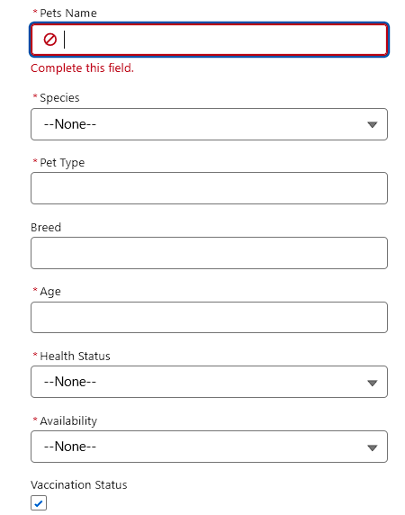
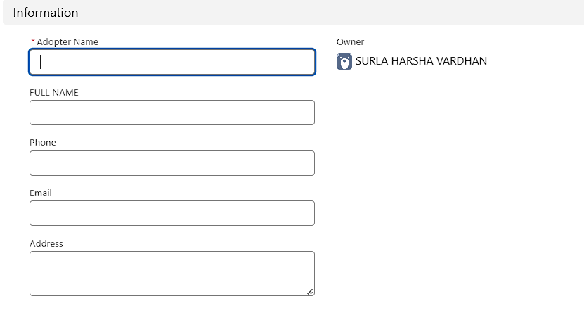
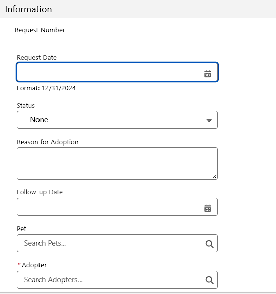
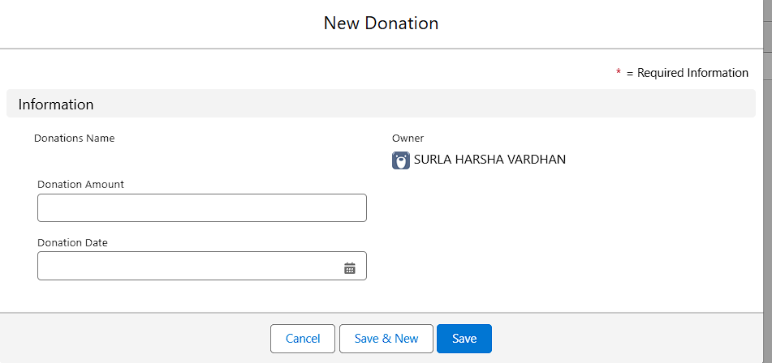
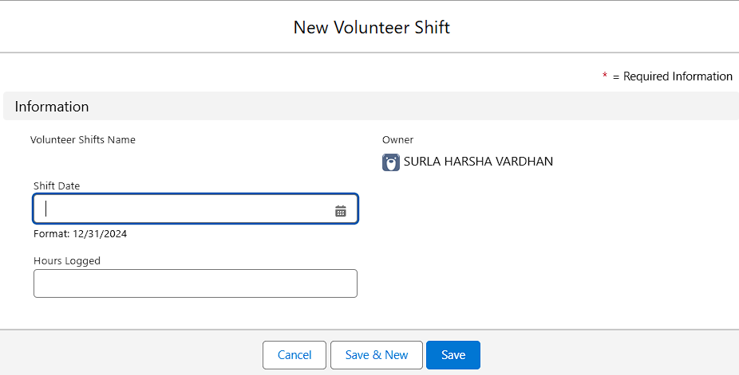
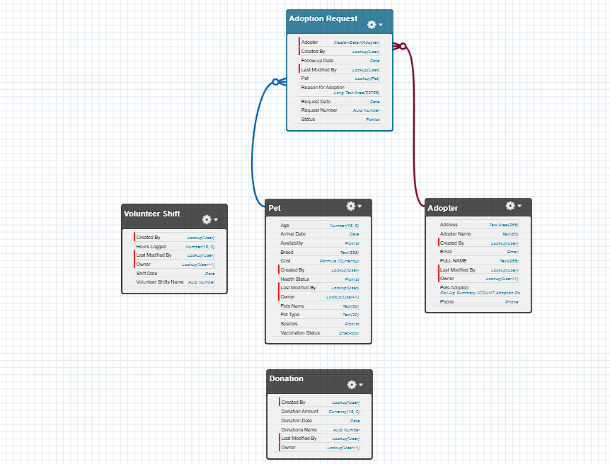

# 🐾 Pet Adoption Tracker CRM – Phase 3: Data Modeling & Relationships

## Overview
This document outlines the data model for the Pet Adoption Tracker CRM, a Salesforce-based application designed to streamline the pet adoption process. Phase 3 focuses on creating the core objects, fields, and relationships that will allow information to flow seamlessly and be easily accessible.

---

## 1. Standard & Custom Objects
Based on the app's navigation bar, the data model is built using the following objects:

- **`Pet__c`**: A custom object to store all details about animals available for adoption.
- **`Adopter__c`**: A custom object to track the details of individuals and families looking to adopt a pet.
- **`Adoption_Request__c`**: A custom object that manages the formal adoption application process.
- **`Donation__c`**: A custom object to record and manage all financial contributions.
- **`Volunteer_Shift__c`**: A custom object to schedule and track volunteer work.
- **`Home`**: The standard Salesforce homepage, which can be customized.
- **`Reports`**: A standard Salesforce object for creating and viewing reports.
- **`Dashboards`**: A standard Salesforce object for visualizing data from reports.

These objects are the primary data containers for all adoption-related information.

---

## 2. Fields
Key fields were added to each custom object to capture essential data. Below are examples of the fields created:

### Pet__c Fields
| Field Label | API Name | Data Type | Description |
|---|---|---|---|
| Pet Name | `Pet_Name__c` | Text | The name of the pet. |
| Species | `Species__c` | Picklist | Dog, Cat, etc. |
| Status | `Status__c` | Picklist | Available, Adopted, Fostered. |
| Date of Birth | `Date_of_Birth__c` | Date | Pet's birthdate. |
| Adoption Fee | `Adoption_Fee__c` | Currency | The cost to adopt the pet. |

 

### Adopter__c Fields
| Field Label | API Name | Data Type | Description |
|---|---|---|---|
| First Name | `First_Name__c` | Text | Adopter's first name. |
| Last Name | `Last_Name__c` | Text | Adopter's last name. |
| Home Type | `Home_Type__c` | Picklist | Apartment, House, Condo. |
| Existing Pets | `Existing_Pets__c` | Number | The number of other pets in the household. |

 

### Adoption_Request__c Fields
| Field Label | API Name | Data Type | Description |
|---|---|---|---|
| Request Number | `Request_Number__c` | Auto Number | A unique identifier for each request. |
| Status | `Status__c` | Picklist | Submitted, Under Review, Approved, Denied. |
| Request Date | `Request_Date__c` | Date | The date the request was submitted. |

 

### Donation__c Fields
| Field Label | API Name | Data Type | Description |
|---|---|---|---|
| Donation Amount | `Donation_Amount__c` | Currency | The amount of the donation. |
| Donation Date | `Donation_Date__c` | Date | The date the donation was made. |

###  Volunteer_Shift__c Fields
| Field Label | API Name | Data Type | Description |
|---|---|---|---|
| Shift Date | `Shift_Date__c` | Date | The date of the volunteer shift. |
| Hours Logged | `Hours_Logged__c` | Number | The number of hours worked during the shift. |

---

## 3. Page Layouts & Compact Layouts
**Page Layouts** were created to control the fields, sections, and related lists users see on a record's detail page. This provides a tailored user experience based on their profile. For example, a **"Volunteer"** profile might see a simplified layout for the **Pet** object, while an **"Admin"** profile sees all fields, including internal-use-only fields.

**Compact Layouts** are essential for quick access to key information, especially on mobile devices and in the highlights panel at the top of a record. For our objects, we've defined the following key fields to be displayed:

* **Pet:** `Pet_Name__c`, `Status__c`, `Species__c`, `Adoption_Fee__c`
* **Adopter:** `First_Name__c`, `Last_Name__c`, `Home_Type__c`, `Email__c`
* **Adoption_Request:** `Request_Number__c`, `Status__c`, `Adopter__c`, `Pet__c`

---

## 4. Schema Builder & Relationships
**Schema Builder** was used to visually plan and build the data model. It provides a clear map of how all the objects are interconnected.

### Relationship Types
* **Lookup vs. Master-Detail vs. Hierarchical**: We used **lookup relationships** for connections where the child record can exist independently of the parent. For example, a lookup field on **`Adoption_Request__c`** to **`Adopter__c`** links a request to the person who made it. We did not use a **Master-Detail** relationship as the child records in this model are not fully dependent on a single parent. We also did not use a **Hierarchical** relationship.

* **Junction Objects**: To model a many-to-many relationship between **`Volunteer_Shift__c`** and **`Contact`**, a junction object could be used to track specific tasks or roles within a shift.

* **External Objects**: This project does not currently use any external objects. These would be used if we needed to access data stored outside of Salesforce, such as a third-party veterinary clinic's database, without migrating the data into our CRM.

 

---

###
